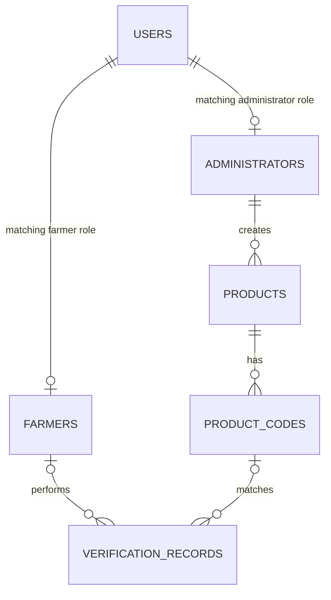

# Database schema and migrations

This directory implements the six core tables from the project diagram for the first milestone. It uses the existing PostgreSQL driver; no additional ORM or migration dependency is required.

## Commands

From the repository root, with PostgreSQL running:

```sh
npm run db:status
npm run db:migrate
npm run db:test
```

The commands use `DATABASE_URL` from the process environment when supplied (for example, in CI); otherwise they read `backend/.env`. They resolve paths relative to their own files, so the migration files do not depend on the terminal's working directory.

`db:migrate` applies pending SQL files in filename order, inside one transaction. A transaction-level advisory lock prevents two commands from applying the same migration concurrently. The `schema_migrations` table records each version, filename, checksum and application time. Repeating the command does not recreate tables or remove records. `db:status` only reads the migration history.

Add subsequent changes as `002_descriptive_name.sql`, then `003_...`, and so on. Keep the three-digit prefix unique. Applied migrations must not be edited, removed or reordered; the runner refuses mismatched history. Checksums normalize Windows CRLF line endings to LF. If a pending migration fails, all changes from that invocation are rolled back. Fix the unapplied migration and retry. There is deliberately no automatic reset or destructive rollback command.

## Tables

| Table | Main fields and purpose |
| --- | --- |
| `users` | Identity ID, full name, phone, email, password hash, role, account status and creation timestamp. |
| `farmers` | Shared `user_id`, optional county and preferred access channel. |
| `administrators` | Shared `user_id`, unique staff number and permission level. |
| `products` | Name, seed/fertilizer category, manufacturer, optional registration reference and description, status, administrator creator and creation timestamp. |
| `product_codes` | Product reference, unique code, batch, optional manufacture date, required expiry date, stored status and creation timestamp. |
| `verification_records` | Optional farmer, optional registered code, submitted input, result, channel, optional county and verification timestamp. |

The application tables are initially empty. There are no seeded accounts, default passwords or claimed regulatory records. `schema_migrations` is a separate infrastructure table, not a business entity.



Exactly one of the two account profiles must exist, according to `users.role`. The two optional branches in the diagram above are mutually exclusive.

## Account and profile integrity

The original diagram requires a separate farmer or administrator row with the same primary key as its user, and exactly one matching profile per account. Two internal generated columns on `users` (`farmer_profile_id` and `administrator_profile_id`) and deferred foreign keys enforce that rule in PostgreSQL, including concurrent writes. These are implementation helpers, not additional user data; never supply their values or expose them in an account API.

Create the user and matching profile in the **same transaction and on the same database client**. The profile requirement is checked at commit. A user insert by itself will fail when committed. For example, a future authentication service will use this pattern after validating input and hashing the password:

```js
await client.query('BEGIN');
try {
  const result = await client.query(
    `INSERT INTO users (full_name, email, password_hash, role)
     VALUES ($1, $2, $3, 'farmer') RETURNING id`,
    [fullName, email, passwordHash],
  );
  await client.query(
    'INSERT INTO farmers (user_id, county) VALUES ($1, $2)',
    [result.rows[0].id, county],
  );
  await client.query('COMMIT');
} catch (error) {
  await client.query('ROLLBACK');
  throw error;
}
```

Use explicit column lists when selecting users, especially for API responses. Do not return `password_hash` or the internal profile references. PostgreSQL `BIGINT` IDs are returned by `pg` as strings; keep that representation rather than converting arbitrary IDs to JavaScript numbers.

## Validation and storage rules

- Accounts require an email address or a phone number, or both. Email uniqueness ignores letter case. Normalize phone numbers to E.164 before writing, for example `+254700000001`; uniqueness applies to the normalized value. Empty names, passwords and supplied contact values are rejected. Password hashing itself belongs to the authentication service; a text column cannot establish that its contents are a secure hash.
- Account statuses are `active`, `inactive` and `suspended`. Account roles are `farmer` and `administrator`. Administrator permission levels are `standard` and `super_admin`; authentication and permission enforcement are still to be implemented.
- Products are limited to `seed` and `fertilizer`, and only an administrator profile can be recorded as their creator. A stored registration number is a reference, not evidence of approval by a regulator.
- Product and code statuses are `active`, `inactive` and `suspicious`. Codes are unique regardless of case and cannot contain whitespace. Future lookup queries should use `upper(code_value) = upper($1)` so they use the unique index. The entered string in verification history is retained separately.
- Expiry cannot precede manufacture when the manufacture date is known. Expired products remain valid historical data. The future verification service will derive the `expired` outcome from the date instead of storing an expiry flag that becomes stale.
- Verification results are `verified`, `expired`, `suspicious`, `unregistered`, `invalid` and `reported`. `reported` is reserved for the reporting milestone. `web` and `ussd` are accepted channels; this does not implement USSD access.
- An unknown or invalid code has no `product_code_id`. The other outcomes require a registered code reference. Invalid input may be empty; non-invalid input must contain a value. Inputs are limited to the diagram's 80-character field; the API must reject overlong input before insertion.
- `farmer_id` is nullable so guests can verify products. All event timestamps use `TIMESTAMPTZ` and default to the database transaction's current time. Verification results are historical snapshots, not automatically changed when a product is later edited.

## Deletion and indexes

Deleting a user removes its matching profile. A farmer's verification history is retained with `farmer_id` set to null. An administrator who created products cannot be deleted while those product references remain. Products with codes and codes with verification history also cannot be deleted; use their inactive status to preserve the records.

Primary keys, case-insensitive email/code indexes, phone and staff-number uniqueness support account and code lookups. Additional indexes support administrator product lists, product-code lists, personal/code verification history and recent verification activity.

## Testing

`npm run db:test` creates randomly named `agro_test_...` schemas in the configured database, tests real PostgreSQL constraints and migration behavior, then drops only those test schemas. It never resets the application schema. The database user needs schema-creation privileges for these tests; the local Docker and CI users have them.

Tests cover repeatable and concurrent migrations, checksum mismatch, atomic failure, matching account profiles, role changes, unique contacts and codes, product ownership, dates, guest/unknown-code history and deletion protection. Test data stays in these temporary schemas. Test password markers are not login credentials.

## Deferred scope

`suspicious_reports` and `ussd_sessions` will be added with their respective modules. Dashboard summaries will be derived from actual records when monitoring is implemented; no summary table is needed for this milestone. This step adds database structure, not registration, login or verification endpoints.

References: [PostgreSQL constraints](https://www.postgresql.org/docs/18/ddl-constraints.html), [generated columns](https://www.postgresql.org/docs/18/ddl-generated-columns.html), and [node-postgres transactions](https://node-postgres.com/features/transactions).
